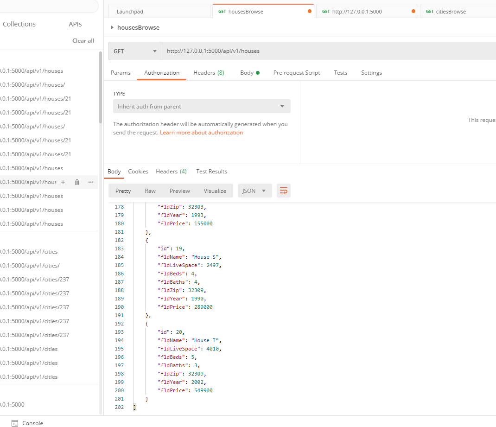
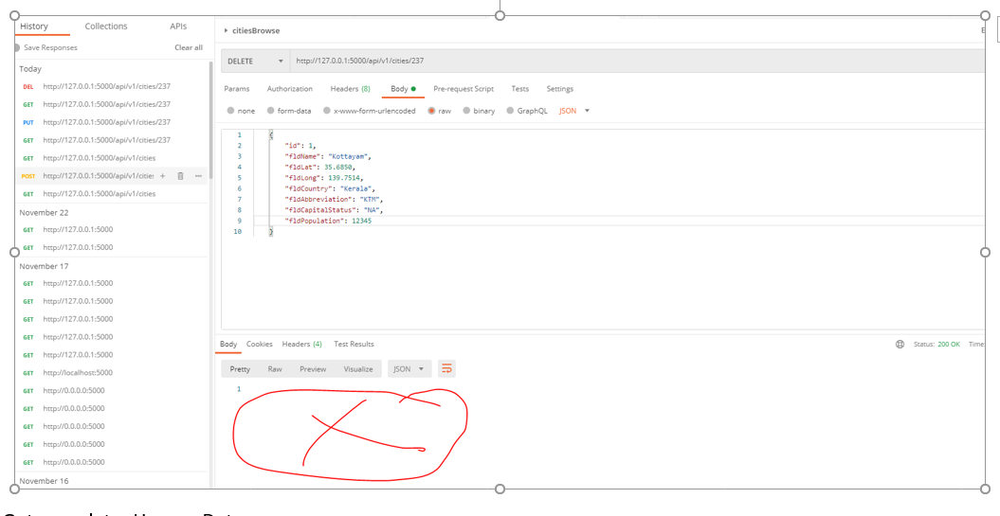

# IndividalProject601Sheethal

##Project Description
This project is a homework assignment utilizes Pycharm setup with Docker, Flask, MySQL, and Postman
to host a local host website with data.
###Postman Screenshot - zillowData
Get Houses Zillow Data from zillowData database

POST Request for a new house Ravenclaw

PUT Request for editing Ravenclaw price

DELETE Request for deleting the added record House Ravenclaw

###Postman Screenshot - citiesData
POST request 

GET request added new city

PUT Request

Delete request

